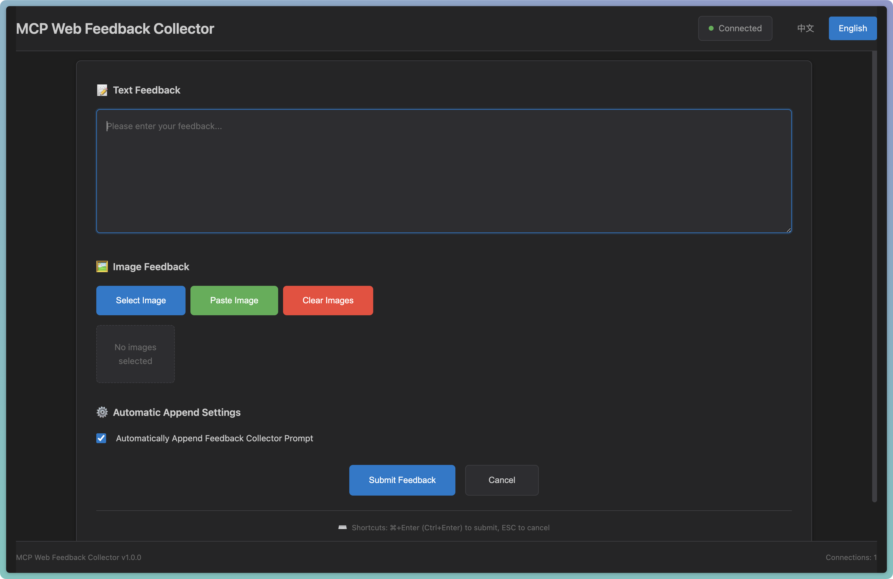

# MCP Web Feedback Collector

<div align="center">

**English | [中文](README_CN.md)**

</div>

<div align="center">


**A Web-based MCP (Model Context Protocol) feedback collection tool designed for remote development environments**

[Features](#features) • [Interface Preview](#interface-preview) • [Quick Start](#quick-start) • [Configuration](#configuration) • [User Guide](#user-guide) • [Project Architecture](#project-architecture)

</div>

## 📖 Project Overview

MCP Web Feedback Collector is an innovative solution specifically designed for development scenarios where you connect to remote servers via SSH. This project is based on the original [feedback_collector](https://github.com/weirdowaoo/feedback_collector) project, extending it to solve the limitation where traditional local GUI feedback collection methods cannot be used in remote development environments. This tool perfectly solves this problem through a web interface.

### 🔄 Project Relationship

- **[Original Project](https://github.com/weirdowaoo/feedback_collector)**: Traditional local GUI-based feedback collection tool
- **This Project**: Web-based version designed for remote development environments

**Choose the right tool for your needs:**
- Use the **original project** if you're developing locally and prefer native GUI interfaces
- Use **this project** if you're developing on remote servers via SSH or prefer web-based interfaces

### 🎯 Problems Solved

- **Remote Development Limitations**: SSH connections cannot use local GUI interfaces
- **AI Interaction Requirements**: Need to provide text and image feedback to AI
- **Real-time Communication Needs**: Require instant bidirectional communication mechanisms
- **Multi-language Support**: Need to support Chinese and English interface switching

## 🖼️ Interface Preview

<table>
  <tr>
    <td align="center"><b>Chinese Interface</b></td>
    <td align="center"><b>English Interface</b></td>
  </tr>
  <tr>
    <td></td>
    <td></td>
  </tr>
</table>

## ✨ Features

### 🌐 Web Interface
- **No Local GUI Required**: Access through browser, perfectly adapted for remote development
- **Responsive Design**: Adapts to various screen sizes, supports mobile access
- **Dark Theme**: Consistent with Cursor editor style

### 🔄 Real-time Communication
- **WebSocket Connection**: Real-time bidirectional communication based on WebSocket
- **Auto Reconnection**: Automatically reconnects when network disconnects, ensuring stability
- **Heartbeat Detection**: Regular heartbeat detection to timely discover connection issues

### 📝 Multimedia Feedback
- **Text Input**: Supports multi-line text input and editing
- **Image Upload**: Supports paste upload, and file selection
- **Format Support**: Supports PNG, JPG, JPEG, GIF, WebP, BMP and other formats
- **Size Limit**: Default support for image files up to 10MB

### ⌨️ Convenient Operations
- **Shortcut Key Support**: Ctrl+Enter (Windows/Linux) or Cmd+Enter (Mac) to submit, ESC to cancel
- **Auto Focus**: Automatically focus on input box when interface is activated
- **Timeout Protection**: Default 10-minute timeout to prevent infinite waiting

## 🚀 Quick Start

### Requirements

- Python 3.8+
- AI programming assistant that supports MCP (such as Cursor)
- Modern browser (supports WebSocket)

### Installation Steps

1. **Clone Project**
   ```bash
   git clone <repository-url>
   cd feedback_collector_web
   ```

2. **Install Dependencies**
   ```bash
   pip install -r requirements.txt
   ```

3. **Configure MCP Server**
   
   Add the following configuration to Cursor's MCP configuration file:
   ```json
   {
     "mcpServers": {
       "feedback-collector-web": {
         "command": "/path/to/your/python",
         "args": ["/path/to/feedback_collector_web/mcp_server.py"],
         "env": {
           "WEB_HOST": "0.0.0.0",
           "WEB_PORT": "9999",
           "FEEDBACK_TIMEOUT": "600"
         }
       }
     }
   }
   ```

4. **Start Web Server**
   ```bash
   python run.py
   ```

5. **Access Interface**
   
   Open browser and visit: `http://server-ip:9999`

## ⚙️ Configuration

### Environment Variables

| Variable | Default | Description |
|----------|---------|-------------|
| `WEB_HOST` | `0.0.0.0` | Web server bind address |
| `WEB_PORT` | `9999` | Web server port |
| `FEEDBACK_TIMEOUT` | `600` | Feedback timeout (seconds) |


## 📚 User Guide

### Basic Usage Flow

1. **Start Services**: Ensure both MCP server and Web server are running
2. **Trigger invocation**: In Agent mode, simply enter: **Collect user feedback**.
3. **Interface Activation**: Web interface automatically switches from waiting state to feedback collection state
4. **Provide Feedback**: Input text or upload images
5. **Submit Feedback**: Click submit button or use shortcut keys
6. **Continue Conversation**: AI continues conversation after receiving feedback

### Advanced Features

#### Image Upload Methods
- **File Selection**: Click "Choose Images" button
- **Drag and Drop**: Directly drag images to preview area
- **Clipboard Paste**: Copy image then click "Paste Image" or use Ctrl+V

#### Auto Append Settings
- **Enable**: Automatically add prompt to continue collecting feedback after feedback
- **Disable**: Only submit user feedback without additional prompt

#### Language Switching
- Click "中文"/"English" button in top right corner
- Via URL parameter: `?lang=CN` or `?lang=EN`

## 🏗️ Project Architecture

### Overall Architecture

```
Separated Architecture
┌─────────────────┐    HTTP API    ┌─────────────────┐
│   mcp_server.py │ ◄─────────────► │ src/web_server.py│
│  (MCP Server)   │                │   (Web Server)   │
└─────────────────┘                └─────────────────┘
        ▲                                    ▲
        │                                    │
   Cursor MCP                           Browser Access
```

### Directory Structure

```
├── mcp_server.py             # MCP server entry (standalone mode)
├── run.py                    # Web server startup script
├── cursor_mcp_config.json    # MCP configuration file
├── requirements.txt          # Python dependencies
├── README.md                 # Project documentation (English)
├── README_CN.md              # Project documentation (Chinese)
└── src/
    ├── web_server.py         # Web server entry
    ├── core/                 # Core business logic
    │   ├── feedback_collector.py    # Feedback collector
    │   └── websocket_manager.py     # WebSocket connection management
    ├── web/                  # Web interface
    │   ├── static/           # Static resources
    │   │   ├── css/style.css    # Style file
    │   │   └── js/              # JavaScript files
    │   └── templates/        # HTML templates
    │       └── index.html       # Main page
    └── utils/                # Utility modules
        ├── config.py            # Configuration management
        ├── logger.py            # Log management
        └── i18n.py              # Internationalization module
```

### Technology Stack

- **Backend Framework**: FastAPI + FastMCP
- **Frontend Technology**: HTML5 + CSS3 + Vanilla JavaScript
- **Communication Protocol**: WebSocket + HTTP API
- **Deployment Method**: Uvicorn ASGI server
- **Internationalization**: Custom i18n module

 