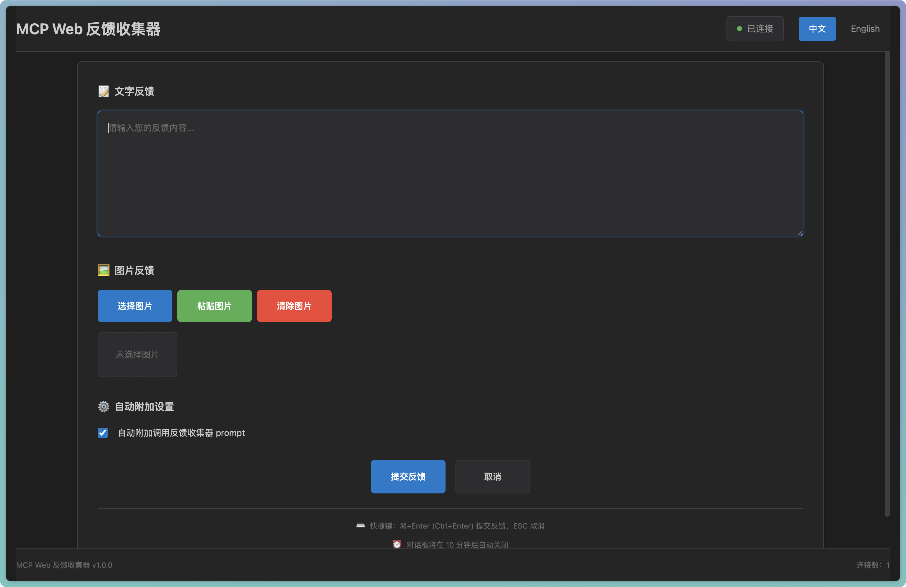
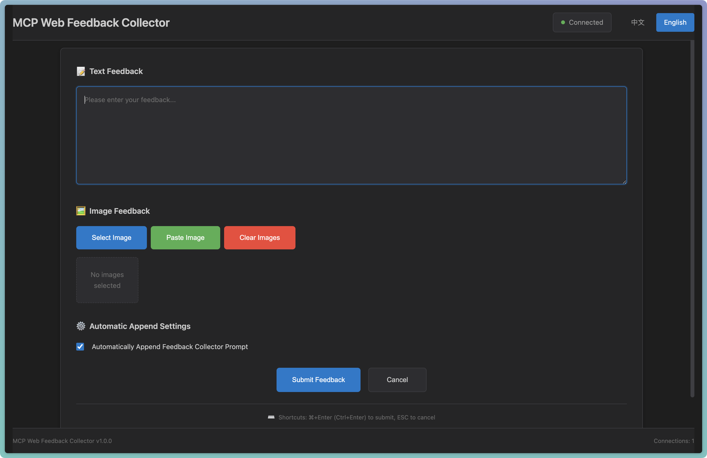

# MCP Web 反馈收集器

<div align="center">

**[English](README.md) | 中文**

</div>

<div align="center">


**一个专为远程开发环境设计的 Web 版 MCP (Model Context Protocol) 反馈收集工具**

[功能特性](#功能特性) • [界面预览](#界面预览) • [快速开始](#快速开始) • [配置说明](#配置说明) • [使用指南](#使用指南) • [项目架构](#项目架构)

</div>

## 📖 项目简介

MCP Web 反馈收集器是一个创新的解决方案，专门为通过 SSH 连接到远程服务器进行开发的场景设计。本项目基于原始的 [feedback_collector](https://github.com/weirdowaoo/feedback_collector) 项目，扩展解决了传统本地图形界面反馈收集方式在远程开发环境中无法使用的限制。本工具通过 Web 界面完美解决了这个问题。

### 🔄 项目关系

- **[原始项目](https://github.com/weirdowaoo/feedback_collector)**：传统的本地图形界面反馈收集工具
- **本项目**：专为远程开发环境设计的 Web 版本

**根据需求选择合适的工具：**
- 如果你在本地开发并偏好原生图形界面，请使用**原始项目**
- 如果你通过 SSH 在远程服务器开发或偏好 Web 界面，请使用**本项目**

### 🎯 解决的问题

- **远程开发限制**：SSH 连接无法使用本地图形界面
- **AI 交互需求**：需要向 AI 提供文字和图片反馈
- **实时通信要求**：需要即时的双向通信机制
- **多语言支持**：需要支持中英文界面切换

## 🖼️ 界面预览

<table>
  <tr>
    <td align="center"><b>中文界面</b></td>
    <td align="center"><b>英文界面</b></td>
  </tr>
  <tr>
    <td></td>
    <td></td>
  </tr>
</table>

## ✨ 功能特性

### 🌐 Web 界面
- **无需本地图形界面**：通过浏览器访问，完美适配远程开发
- **响应式设计**：适配各种屏幕尺寸，支持移动端访问
- **深色主题**：与 Cursor 编辑器风格保持一致

### 🔄 实时通信
- **WebSocket 连接**：基于 WebSocket 的实时双向通信
- **自动重连**：网络断开时自动重连，确保稳定性
- **心跳检测**：定期心跳检测，及时发现连接问题

### 📝 多媒体反馈
- **文字输入**：支持多行文本输入和编辑
- **图片上传**：支持粘贴上传和文件选择
- **格式支持**：支持 PNG、JPG、JPEG、GIF、WebP、BMP 等格式
- **大小限制**：默认支持最大 10MB 的图片文件

### ⌨️ 便捷操作
- **快捷键支持**：Ctrl+Enter（Windows/Linux）或 Cmd+Enter（Mac）提交，ESC 取消
- **自动聚焦**：界面激活时自动聚焦到输入框
- **超时保护**：默认 10 分钟超时，防止无限等待

## 🚀 快速开始

### 环境要求

- Python 3.8+
- 支持 MCP 的 AI 编程助手（如 Cursor）
- 现代浏览器（支持 WebSocket）

### 安装步骤

1. **克隆项目**
   ```bash
   git clone <repository-url>
   cd feedback_collector_web
   ```

2. **安装依赖**
   ```bash
   pip install -r requirements.txt
   ```

3. **配置 MCP 服务器**
   
   将以下配置添加到 Cursor 的 MCP 配置文件中：
   ```json
   {
     "mcpServers": {
       "feedback-collector-web": {
         "command": "/path/to/your/python",
         "args": ["/path/to/feedback_collector_web/mcp_server.py"],
         "env": {
           "WEB_HOST": "0.0.0.0",
           "WEB_PORT": "9999",
           "FEEDBACK_TIMEOUT": "600"
         }
       }
     }
   }
   ```

4. **启动 Web 服务器**
   ```bash
   python run.py
   ```

5. **访问界面**
   
   打开浏览器访问：`http://服务器IP:9999`

## ⚙️ 配置说明

### 环境变量配置

| 变量名 | 默认值 | 说明 |
|--------|--------|------|
| `WEB_HOST` | `0.0.0.0` | Web 服务器绑定地址 |
| `WEB_PORT` | `9999` | Web 服务器端口 |
| `FEEDBACK_TIMEOUT` | `600` | 反馈超时时间（秒） |


## 📚 使用指南

### 基本使用流程

1. **启动服务**：确保 MCP 服务器和 Web 服务器都在运行
2. **触发调用**：在 Agent 模式下直接输入：**收集用户反馈**
3. **界面激活**：Web 界面自动从等待状态切换到反馈收集状态
4. **提供反馈**：输入文字或上传图片
5. **提交反馈**：点击提交按钮或使用快捷键
6. **继续对话**：AI 收到反馈后继续对话

### 高级功能

#### 图片上传方式
- **文件选择**：点击"选择图片"按钮
- **拖拽上传**：直接拖拽图片到预览区域
- **剪贴板粘贴**：复制图片后点击"粘贴图片"或使用 Ctrl+V

#### 自动附加设置
- **启用**：自动在反馈后添加提示 AI 继续收集反馈的 prompt
- **禁用**：只提交用户反馈，不添加额外 prompt

#### 语言切换
- 点击右上角的"中文"/"English"按钮
- 通过 URL 参数：`?lang=CN` 或 `?lang=EN`

## 🏗️ 项目架构

### 整体架构

```
分离式架构
┌─────────────────┐    HTTP API    ┌─────────────────┐
│   mcp_server.py │ ◄─────────────► │ src/web_server.py│
│  (MCP服务器)     │                │   (Web服务器)    │
└─────────────────┘                └─────────────────┘
        ▲                                    ▲
        │                                    │
   Cursor MCP                           浏览器访问
```

### 目录结构

```
├── mcp_server.py             # MCP 服务器入口（独立模式）
├── run.py                    # Web 服务器启动脚本
├── cursor_mcp_config.json    # MCP 配置文件
├── requirements.txt          # Python 依赖
├── README.md                 # 项目文档
└── src/
    ├── web_server.py         # Web 服务器入口
    ├── core/                 # 核心业务逻辑
    │   ├── feedback_collector.py    # 反馈收集器
    │   └── websocket_manager.py     # WebSocket 连接管理
    ├── web/                  # Web 界面
    │   ├── static/           # 静态资源
    │   │   ├── css/style.css    # 样式文件
    │   │   └── js/              # JavaScript 文件
    │   └── templates/        # HTML 模板
    │       └── index.html       # 主页面
    └── utils/                # 工具模块
        ├── config.py            # 配置管理
        ├── logger.py            # 日志管理
        └── i18n.py              # 国际化模块
```

### 技术栈

- **后端框架**：FastAPI + FastMCP
- **前端技术**：HTML5 + CSS3 + Vanilla JavaScript
- **通信协议**：WebSocket + HTTP API
- **部署方式**：Uvicorn ASGI 服务器
- **国际化**：自定义 i18n 模块

 